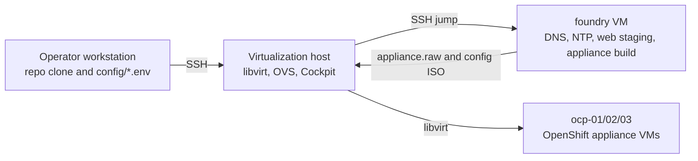

# Appliance Install

Customer-demo setup assets for the Calabi on-prem OpenShift appliance lab.

The latest validated appliance install completed successfully with OpenShift
4.21.15 from the 4.21 appliance build. Keep validation notes publishable: do
not record kubeadmin passwords, pull secrets, RHSM credentials, or private
workstation paths in this repository.

## Execution Model

Run the numbered scripts from the operator workstation, in the local clone of
this repository. The scripts connect to the virtualization host over SSH and
make changes there. Later scripts also SSH through the virtualization host to
foundry, where OpenShift appliance assets are prepared.



## Where Things Run

| Thing | Where it runs | Purpose |
| --- | --- | --- |
| `config/*.env` | Operator workstation | Local settings read by the scripts. |
| `config/appliance.env.example` | Tracked template | Sanitized OpenShift appliance build and VM defaults. |
| `config/operators.env.example` | Tracked template | Sanitized default operator catalog, packages, and channels mirrored into `appliance.raw`. |
| `scripts/01-register-rhn.sh` | Operator workstation | Registers the remote virtualization host with Red Hat. |
| `scripts/02-install-host-packages.sh` | Operator workstation | Installs packages on the remote virtualization host, then reboots it. |
| `scripts/03-enable-host-services.sh` | Operator workstation | Enables services and the default libvirt image pool on the remote virtualization host. |
| `scripts/04-configure-ovs-networks.sh` | Operator workstation | Creates OVS/libvirt networking on the remote virtualization host. |
| `scripts/05-verify-virt-host.sh` | Operator workstation | Runs verification commands against the remote virtualization host. |
| `scripts/06-create-foundry-vm.sh` | Operator workstation | Creates the foundry VM on the remote virtualization host. |
| `scripts/07-configure-foundry-console.sh` | Operator workstation | Sets foundry console passwords through the virtualization host jump path. |
| `scripts/08-configure-foundry-services.sh` | Operator workstation | Configures foundry through the virtualization host jump path. |
| `scripts/09-verify-foundry-services.sh` | Operator workstation | Verifies foundry DNS, NTP, and staging services. |
| `scripts/10-prepare-appliance-assets.sh` | Operator workstation | Copies local-only appliance secrets to foundry and writes generated OpenShift YAML there, including Agent Installer NTP settings. |
| `scripts/11-build-appliance-image.sh` | Operator workstation | Starts the long OpenShift appliance image build on foundry. |
| `scripts/12-create-cluster-config-image.sh` | Operator workstation | Creates the Agent Installer config ISO on foundry. |
| `scripts/13-create-ocp-vms.sh` | Operator workstation | Pulls appliance artifacts directly from foundry to the virtualization host and creates `ocp-01`, `ocp-02`, and `ocp-03`. |
| `scripts/14-destroy-ocp-vms.sh` | Operator workstation | Removes the OpenShift VM domains and overlay disks so script `13` can reimage them. |
| `scripts/15-watch-ocp-install.sh` | Operator workstation | Streams installer wait commands through foundry with sudo. |
| `scripts/16-verify-ocp-cluster.sh` | Operator workstation | Verifies the installed cluster through a temporary local API tunnel. |
| `scripts/lib/remote.sh` | Sourced by numbered scripts | Shared SSH/config helper. Do not run it directly. |
| `/usr/local/sbin/appliance-install-net.sh` | Virtualization host | Generated by script `04`; recreates OVS ports. |
| `appliance-install-net.service` | Virtualization host | Generated by script `04`; runs OVS setup at boot. |
| `foundry` VM | Virtualization host | Dual-homed VM for DNS, NTP, staging, mirroring, and appliance image work. |
| `/home/libvirt/images/appliance-install` | Virtualization host | Default location for OpenShift appliance artifacts and VM overlay disks. |

VM work is still launched from the operator workstation. Script `06` copies the
operator-provided RHEL cloud image into a standalone foundry QCOW2 and attaches a
NoCloud cloud-init seed ISO. Scripts that configure services inside foundry use
SSH through the virtualization host jump path. Scripts `10` through `12`
prepare OpenShift appliance content on foundry. Script `13` uses temporary
direct virt-host-to-foundry SSH access to pull the finished `appliance.raw` and
`agentconfig.noarch.iso` to the virtualization host, then creates the three
OpenShift VMs. That direct transfer avoids routing large sparse artifacts
through the operator workstation.

## Golden Path

Use this first-pass flow for a new lab. Run every command from the repository
root on the operator workstation:

| Phase | Scripts | What to watch for |
| --- | --- | --- |
| Local config | Copy `config/*.env.example` to ignored `config/*.env` files | Keep real pull secrets, activation keys, passwords, private hostnames, and private file locations out of tracked files. |
| Host setup | `01` through `05` | Script `02` reboots the virtualization host; wait for SSH before continuing. |
| Foundry setup | `06` through `09` | Script `06` waits for foundry SSH; script `08` can be long while installing packages and IdM. |
| Appliance build | `10` through `12` | Script `10` writes `additionalNTPSources` into `agent-config.yaml` from `APPLIANCE_AGENT_NTP_SOURCE`, defaulting to foundry/IdM, and writes the operator list from `config/operators.env`. Script `11` is the longest phase and can be quiet while pulling and mirroring OpenShift 4.21 content and operators. Script `12` creates `agentconfig.noarch.iso`. |
| VM boot | `13` | The first run copies `appliance.raw`, converts it to `appliance-base.qcow2`, and creates node overlays. Later runs reuse `appliance-base.qcow2` by default when `APPLIANCE_REFRESH_BASE_IMAGE=false`. |
| Install watch | `15` | The installer wait commands run with sudo and can sit with little output while the nodes boot, form the cluster, and settle operators. |
| Cluster verification | `16` | The script creates a temporary local API tunnel through the virtualization host, uses a temporary kubeconfig copy, runs sanitized `oc` checks, then cleans up. |

The default OpenShift 4.21 appliance build includes the requested operator set.
To customize mirrored operators, copy `config/operators.env.example` to ignored
`config/operators.env` and edit the package/channel entries before running
script `10`.

| Capability | Appliance package entries |
| --- | --- |
| OpenShift Virtualization | `kubevirt-hyperconverged` |
| OpenShift Data Foundation | `odf-operator`, `ocs-operator`, `mcg-operator`, `odf-csi-addons-operator`, `odf-dependencies`, `odf-external-snapshotter-operator`, `odf-prometheus-operator`, `ocs-client-operator`, `recipe`, `rook-ceph-operator`, `cephcsi-operator` |
| NMState | `kubernetes-nmstate-operator` |
| cert-manager | `openshift-cert-manager-operator` |
| Network Observability | `netobserv-operator` |
| Web Terminal | `web-terminal` |
| Quay | `quay-operator` |

Before running host setup, create local config files from the examples:

```bash
cp config/host.env.example config/host.env
cp config/rhsm.env.example config/rhsm.env
cp config/network.env.example config/network.env
cp config/foundry.env.example config/foundry.env
cp config/appliance.env.example config/appliance.env
cp config/operators.env.example config/operators.env
```

Edit those local files for the target environment. They are ignored by git.
Keep real pull secrets, activation keys, passwords, and private host values only
in ignored local files or operator-managed secret stores.

First build golden path:

```bash
./scripts/01-register-rhn.sh
./scripts/02-install-host-packages.sh
# wait for the virtualization host to reboot
./scripts/03-enable-host-services.sh
./scripts/04-configure-ovs-networks.sh
./scripts/05-verify-virt-host.sh
./scripts/06-create-foundry-vm.sh
./scripts/07-configure-foundry-console.sh
./scripts/08-configure-foundry-services.sh
./scripts/09-verify-foundry-services.sh
./scripts/10-prepare-appliance-assets.sh
./scripts/11-build-appliance-image.sh
./scripts/12-create-cluster-config-image.sh
./scripts/13-create-ocp-vms.sh
./scripts/15-watch-ocp-install.sh
./scripts/16-verify-ocp-cluster.sh
```

Script `14` is part of the numbered 01-through-16 workflow but is reserved for
reimage cleanup. Do not run it between first VM creation and install watch.

Quick reimage path:

```bash
# Optional when cluster config, NTP, networking, nodes, or pull-secret inputs changed:
./scripts/10-prepare-appliance-assets.sh
./scripts/12-create-cluster-config-image.sh

./scripts/14-destroy-ocp-vms.sh
./scripts/13-create-ocp-vms.sh
./scripts/15-watch-ocp-install.sh
./scripts/16-verify-ocp-cluster.sh
```

The reimage path refreshes only the config ISO and node overlays unless
`APPLIANCE_REFRESH_BASE_IMAGE=true` is set. With the default
`APPLIANCE_REFRESH_BASE_IMAGE=false`, script `13` reuses the existing
`appliance-base.qcow2` and pulls only the current config ISO from foundry.
Script `12` regenerates installer state for the next install, including the
foundry-local kubeconfig, so treat it as the start of a new install attempt.
If `config/operators.env` changes, rerun scripts `10` and `11`, then run script
`13` with `APPLIANCE_REFRESH_BASE_IMAGE=true` so the VM base image is rebuilt
from the new `appliance.raw`.

The default live artifact directory on the virtualization host is
`/home/libvirt/images/appliance-install`, with files such as
`appliance-base.qcow2`, `agentconfig.noarch.iso`, and the node overlay disks.
Treat that path as a configurable example; use the value from ignored local
config for the target lab.

The latest live verification succeeded with all three nodes `Ready`,
ClusterVersion `4.21.15` reporting `Available=True` and `Progressing=False`, no
unhealthy cluster operators, and configured mirrored packages available through
PackageManifest. Do not add kubeadmin passwords or kubeconfig contents to
tracked docs.

`scripts/lib/remote.sh` is not an operator step. It is a shared helper used by
the numbered scripts to load `config/*.env` and run simple SSH commands on the
target host.

See [Execution Model](docs/execution-model.md) for more detail.

## Folder Tree

| Path | Purpose |
| --- | --- |
| `config/host.env.example` | Sanitized virtualization host access defaults. |
| `config/rhsm.env.example` | Sanitized Red Hat registration placeholders. |
| `config/network.env.example` | OVS and libvirt network defaults. |
| `config/foundry.env.example` | Foundry VM, DNS, NTP, and staging defaults. |
| `config/appliance.env.example` | OpenShift 4.21 appliance build, cluster, and VM defaults. |
| `config/operators.env.example` | Default operator catalog, package, and channel list for the appliance build. |
| `docs/` | Public operator notes and partner runbooks. |
| `scripts/01-*.sh` through `scripts/09-*.sh` | Virtualization host and foundry preparation. |
| `scripts/10-*.sh` through `scripts/16-*.sh` | OpenShift appliance asset build, VM creation, reimage, install watch, and cluster verification. |
| `scripts/lib/remote.sh` | Shared SSH and config-loading helper. |

The tracked `config/*.example` files document required values with sanitized
placeholders. Local `config/*.env` files are ignored by git.

## Script Style

Setup work in this repository should be codified as numbered shell scripts:

| Example name | Purpose |
| --- | --- |
| `01-prepare-host.sh` | Early host setup. |
| `02-create-foundry.sh` | Foundry or service setup. |
| `03-create-ocp-vms.sh` | OpenShift VM setup. |

Keep scripts readable. Prefer clear sequential commands over dense one-liners.
Use high-level section comments with `####`, and use single `#` comments for
important individual steps.

Example:

```bash
#### These steps setup Cockpit and libvirt

# Install the virtualization packages
dnf install -y cockpit cockpit-machines libvirt qemu-kvm virt-install
```
