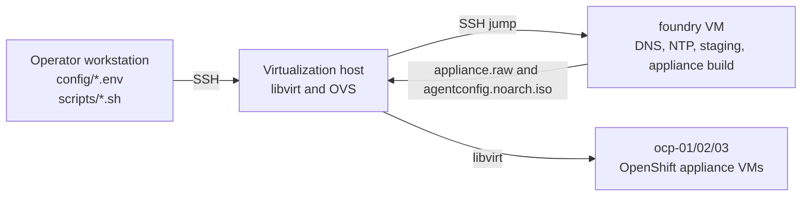

# Execution Model

This repository is run from an operator workstation against a remote
virtualization host.

The operator does not run most setup commands by hand on the host. Instead, the
operator runs numbered scripts from the repository root. Those scripts load
local configuration and use SSH to make the requested change on the target host.
Foundry service and appliance build steps use the virtualization host as an SSH
jump path.



## Run Locations

| Thing | Where it runs | Notes |
| --- | --- | --- |
| Repository clone | Operator workstation | This is where the operator runs `./scripts/*.sh`. |
| `config/*.env` | Operator workstation | Local files, ignored by git. |
| Numbered scripts | Operator workstation | Each script starts from the repository root on the workstation. |
| `scripts/lib/remote.sh` | Sourced by numbered scripts | Helper functions only; do not run directly. |
| RHSM registration commands | Virtualization host | Sent over SSH by `01-register-rhn.sh`. |
| Package installation commands | Virtualization host | Sent over SSH by `02-install-host-packages.sh`; that script reboots the host. |
| Service enablement commands | Virtualization host | Sent over SSH by `03-enable-host-services.sh`; it also enables the default libvirt image pool. |
| OVS/libvirt network commands | Virtualization host | Sent over SSH by `04-configure-ovs-networks.sh`. |
| Foundry VM creation | Virtualization host | Sent over SSH by `06-create-foundry-vm.sh`. |
| Foundry console password commands | Foundry VM | Sent through the virtualization host jump path by `07-configure-foundry-console.sh`. |
| Foundry service commands | Foundry VM | Sent through the virtualization host jump path by `08-configure-foundry-services.sh`. |
| Foundry verification commands | Foundry VM | Sent through the virtualization host jump path by `09-verify-foundry-services.sh`. |
| Appliance asset generation | Foundry VM | Script `10` copies local-only secrets to foundry and writes generated YAML. |
| Appliance image build | Foundry VM | Script `11` runs the appliance builder container and writes `appliance.raw`. |
| Agent config ISO creation | Foundry VM | Script `12` runs `openshift-install agent create config-image`. |
| OpenShift VM creation | Virtualization host | Script `13` pulls artifacts directly from foundry and creates the three node VMs. |
| OpenShift VM reimage cleanup | Virtualization host | Script `14` destroys the node domains and removes only their overlay disks. |
| Install watch | Foundry VM | Script `15` streams `openshift-install agent wait-for` commands. |
| Cluster verification | Operator workstation | Script `16` creates a temporary local API tunnel through the virtualization host and runs `oc` checks with a temporary kubeconfig copy. |
| `/usr/local/sbin/appliance-install-net.sh` | Virtualization host | Generated persistent OVS setup script. |
| `appliance-install-net.service` | Virtualization host | Generated systemd service that reruns OVS setup at boot. |
| IdM DNS, `chronyd`, `httpd` | Foundry VM | Configured by script `08` for the appliance network. |
| `/home/libvirt/images/appliance-install` | Virtualization host | Default OpenShift appliance artifact and VM overlay directory. |

## Local Config Files

Create local config from the tracked examples:

```bash
cp config/host.env.example config/host.env
cp config/foundry.env.example config/foundry.env
cp config/rhsm.env.example config/rhsm.env
cp config/network.env.example config/network.env
cp config/appliance.env.example config/appliance.env
```

`config/host.env` describes how the operator workstation reaches the
virtualization host:

```bash
APPLIANCE_HOST="replace-with-virt-host-address"
APPLIANCE_HOST_USER="root"
APPLIANCE_HOST_SSH_KEY="${HOME}/.ssh/id_ed25519"
```

`config/rhsm.env` contains operator-provided Red Hat registration values:

```bash
RHSM_ORG_ID="replace-with-red-hat-org-id"
RHSM_ACTIVATION_KEY="replace-with-red-hat-activation-key"
```

The copied local files are ignored by git through `config/*.env`.

`config/network.env` describes the OVS-only appliance networks. The initial
design keeps the OpenShift VMs on an OVS bridge without a physical uplink.

`config/foundry.env` describes the foundry VM, DNS records, NTP serving network,
and appliance-builder workspace defaults.

`config/appliance.env` describes the OpenShift release, appliance build
settings, local pull secret path, core console password placeholder, cluster
identity, and OpenShift VM disk location. Keep real pull-secret content and
password values out of tracked files.

All real `config/*.env` files are ignored by git. The tracked
`config/*.env.example` files are sanitized templates.

## Run Order

First build golden path from the repository root:

```bash
./scripts/01-register-rhn.sh
./scripts/02-install-host-packages.sh
# wait for the virtualization host to reboot
./scripts/03-enable-host-services.sh
./scripts/04-configure-ovs-networks.sh
./scripts/05-verify-virt-host.sh
./scripts/06-create-foundry-vm.sh
./scripts/07-configure-foundry-console.sh
./scripts/08-configure-foundry-services.sh
./scripts/09-verify-foundry-services.sh
./scripts/10-prepare-appliance-assets.sh
./scripts/11-build-appliance-image.sh
./scripts/12-create-cluster-config-image.sh
./scripts/13-create-ocp-vms.sh
./scripts/15-watch-ocp-install.sh
./scripts/16-verify-ocp-cluster.sh
```

`./scripts/14-destroy-ocp-vms.sh` is intentionally not in the first-pass run
order. Use it when existing OpenShift node VMs should be removed and reimaged.

Quick reimage path:

```bash
# Optional when cluster config, NTP, networking, nodes, or pull-secret inputs changed:
./scripts/10-prepare-appliance-assets.sh
./scripts/12-create-cluster-config-image.sh

./scripts/14-destroy-ocp-vms.sh
./scripts/13-create-ocp-vms.sh
./scripts/15-watch-ocp-install.sh
./scripts/16-verify-ocp-cluster.sh
```

Script `13` reuses an existing `appliance-base.qcow2` by default when
`APPLIANCE_REFRESH_BASE_IMAGE=false`. In that default mode, the quick reimage
path refreshes only the config ISO and per-node overlays. Script `12`
regenerates installer state for the next install, including the foundry-local
kubeconfig used by scripts `15` and `16`.

## Long-Running Phases

Some scripts intentionally hand off work to remote systems and then stream only
the output those tools produce.

| Script | Long or quiet phase | Completion signal |
| --- | --- | --- |
| `02-install-host-packages.sh` | `dnf install` and the virtualization host reboot. | SSH to the host works again, then script `03` can run. |
| `06-create-foundry-vm.sh` | Image copy, disk resize, VM boot, and foundry SSH wait loop. | The script reports foundry SSH is reachable. |
| `08-configure-foundry-services.sh` | Package installation and IdM setup on foundry. | Script `09` verifies IdM, DNS, NTP, HTTP, and firewall state. |
| `11-build-appliance-image.sh` | Appliance builder pull and OpenShift 4.21 content mirroring. | `qemu-img info`, `ls -lh`, and the appliance image completion message appear for `appliance.raw`. |
| `13-create-ocp-vms.sh` | Direct sparse transfer from foundry to the virtualization host and raw-to-QCOW2 conversion when the base image is refreshed. | `virsh list --all` shows the OpenShift VM domains. |
| `15-watch-ocp-install.sh` | Bootstrap and install wait commands. | `openshift-install` reports bootstrap and install completion. |
| `16-verify-ocp-cluster.sh` | Temporary API tunnel setup and `oc` checks. | Nodes, clusterversion, unhealthy operators, console URL, and selected PackageManifest availability are printed. |

The latest live verification succeeded with all three nodes `Ready`,
ClusterVersion `4.21.15` reporting `Available=True` and `Progressing=False`, no
unhealthy cluster operators, and selected PackageManifest entries available.
Do not copy kubeadmin passwords or kubeconfig contents into tracked docs.

## What remote.sh Does

`scripts/lib/remote.sh` is shared helper code. It is sourced by the numbered
scripts and should not be run directly.

It provides small helper functions:

- `load_host_config`: loads `config/host.env`
- `load_rhsm_config`: loads `config/rhsm.env`
- `load_network_config`: loads `config/network.env`
- `load_foundry_config`: loads `config/foundry.env`
- `load_appliance_config`: loads `config/appliance.env`
- `run_remote`: runs one command over SSH
- `run_remote_bash`: runs a readable multi-line bash block over SSH
- `run_foundry`: runs one command on foundry through the virtualization host
- `run_foundry_bash`: runs a readable multi-line bash block on foundry

The purpose is to keep each numbered script readable while avoiding duplicate
SSH setup code in every file.

## Publishability Rule

Tracked files should remain publishable. Put real environment-specific values in
ignored `config/*.env` files. Keep tracked examples sanitized.
