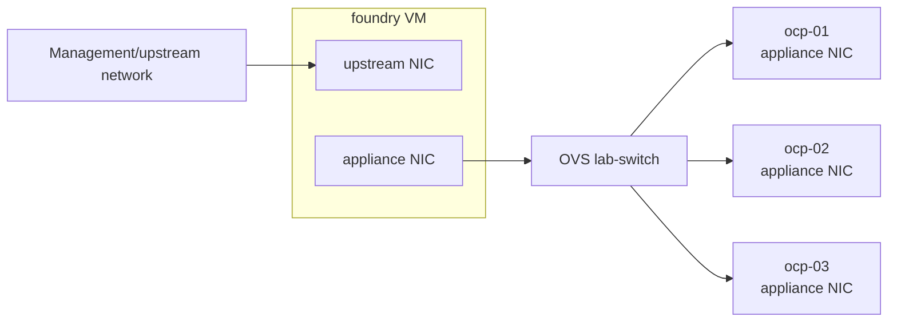

# Network Design

The appliance demo uses Open vSwitch as the lab switch. The OpenShift VMs live
only on networks that exist on that OVS switch.

This page applies to the full virtualized lab path. The standalone foundry path
is build-only and does not configure OVS, libvirt networks, DNS/NTP serving, or
OpenShift deployment VMs.

This gives the demo a clean disconnection story:

- the OpenShift nodes do not have a management or internet-facing NIC
- the OVS appliance switch has no physical uplink
- the host does not provide NAT for the appliance network
- foundry is the controlled boundary between upstream preparation and the
  disconnected install network

## VM Shape



The foundry VM is dual-homed. It can prepare content using its upstream NIC,
then serve DNS, NTP, registry, appliance image build artifacts, and config ISO
content to the appliance network.

The OpenShift nodes are single-homed on the appliance network. Script `13`
creates their VM disks under `/home/libvirt/images/appliance-install` on the
virtualization host by default.

The OpenShift 4.21 appliance image built by scripts `10` and `11` carries the
requested operator content for OpenShift Virtualization, ODF, NMState,
cert-manager, Network Observability, Web Terminal, and Quay. The node VMs still
boot with a single appliance-network NIC; any post-install operator validation
should start from that disconnected network assumption.

See [Foundry VM](foundry.md) for the foundry build and service scripts.

## Initial Networks

The first setup phase creates one OVS bridge and a libvirt network backed by
that bridge:

| Setting | Value |
| --- | --- |
| OVS bridge | `lab-switch` |
| Libvirt network | `lab-switch` |
| Machine VLAN | `200` |
| Machine CIDR | `172.16.10.0/24` |
| Host gateway IP | `172.16.10.1/24` |

Storage and migration VLANs are reserved in `config/network.env.example`, but
they are not required for the initial three-node appliance install.

## OpenShift VM Resources

The three compact-cluster nodes use the published appliance defaults:

| Node | vCPU | Memory | Disk |
| --- | ---: | ---: | ---: |
| `ocp-01` | 12 | 32 GiB | 200 GiB |
| `ocp-02` | 12 | 32 GiB | 200 GiB |
| `ocp-03` | 12 | 32 GiB | 200 GiB |

The OpenShift appliance image requires at least 150 GiB, so the default
`config/appliance.env.example` sets a 200 GiB image size and the node disk
defaults in `config/foundry.env.example` also use 200 GiB. Script `13` converts
the copied `appliance.raw` to a reusable base QCOW2, then creates one overlay
disk per OpenShift node.

## DNS And NTP

Foundry should provide DNS and NTP on the appliance network.

Script `10` writes `additionalNTPSources` into `agent-config.yaml` from
`APPLIANCE_AGENT_NTP_SOURCE`, which defaults to the foundry appliance IP. This
keeps the Agent Installer nodes pointed at the lab NTP source during bootstrap,
when the disconnected appliance network cannot rely on public time servers.

Recommended names:

| Name | Address |
| --- | --- |
| `foundry.appliance.workshop.lan` | `172.16.10.10` |
| `mirror-registry.appliance.workshop.lan` | `172.16.10.10` |
| `api.appliance.workshop.lan` | `172.16.10.5` |
| `api-int.appliance.workshop.lan` | `172.16.10.5` |
| `*.apps.appliance.workshop.lan` | `172.16.10.7` |
| `ocp-01.appliance.workshop.lan` | `172.16.10.11` |
| `ocp-02.appliance.workshop.lan` | `172.16.10.12` |
| `ocp-03.appliance.workshop.lan` | `172.16.10.13` |

Create matching PTR records for the fixed addresses.

Foundry also configures IdM global DNS forwarders from
`APPLIANCE_IDM_DNS_FORWARDERS` so foundry can resolve Red Hat CDN names while
preparing mirrored content. Recursion and query-cache access are restricted to
localhost, so the OpenShift appliance network can use foundry for lab DNS
without becoming an internet-recursive DNS path.

## Hard Disconnection Demo

To demonstrate disconnection, keep the OpenShift nodes attached only to
`lab-switch`. Do not attach a physical uplink to the OVS bridge, and do
not add host NAT for the appliance network.

The default `config/network.env.example` sets:

```bash
APPLIANCE_ENABLE_HOST_IPV4_FORWARDING="true"
```

That keeps the libvirt `default` NAT network working for foundry's upstream
preparation path. It does not add NAT or a physical uplink to `lab-switch`, so
the OpenShift appliance network remains isolated.

The visible disconnection control is foundry's upstream path. When foundry's
upstream NIC or route is disabled, the cluster remains on the isolated OVS
network and can only use content already staged on foundry.
