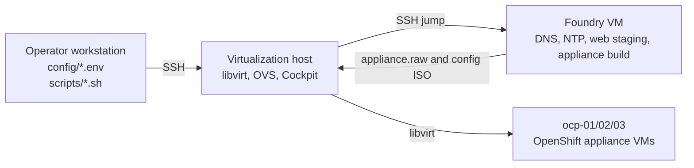

# Partner Runbook

This runbook explains what the numbered setup scripts do for a partner
operator. The scripts prepare a RHEL virtualization host with libvirt, Open
vSwitch, Cockpit, a dual-homed foundry VM, and a three-node OpenShift 4.21
Appliance demo lab.

Run the numbered scripts from the repository root on the operator workstation.
The scripts load ignored local config from `config/*.env`, then use SSH to make
changes on the configured virtualization host. Foundry service scripts reach the
foundry VM through the virtualization host as an SSH jump path.

Tracked files must stay publishable. Do not put real Red Hat org IDs,
activation keys, private hostnames, pull secrets, kubeadmin passwords, or other
passwords in tracked files. Use the tracked `config/*.env.example` files as
templates, then put real values in the ignored local `config/*.env` files.

## Operator Model

The operator runs every numbered script from the workstation clone:



Create local config before running scripts:

```bash
#### Create ignored local config from tracked examples

cp config/host.env.example config/host.env
cp config/rhsm.env.example config/rhsm.env
cp config/network.env.example config/network.env
cp config/foundry.env.example config/foundry.env
cp config/appliance.env.example config/appliance.env
cp config/operators.env.example config/operators.env
cp config/additional-images.env.example config/additional-images.env

#### Edit the ignored files for the target lab

vi config/host.env
vi config/rhsm.env
vi config/network.env
vi config/foundry.env
vi config/appliance.env
vi config/operators.env
vi config/additional-images.env
```

Important local values:

- `config/host.env`: virtualization host address, SSH user, SSH key, and repo
  package defaults.
- `config/rhsm.env`: Red Hat org ID and activation key placeholders for the
  virtualization host and foundry.
- `config/network.env`: OVS bridge, libvirt network, appliance VLANs, and host
  gateway address defaults.
- `config/foundry.env`: foundry VM name, base image path on the virtualization
  host, console password, IdM passwords, DNS forwarders, DNS records, NTP
  network, and staging paths.
- `config/appliance.env`: OpenShift 4.21 appliance release defaults, local pull
  secret file placeholder, core console password placeholder, cluster identity,
  foundry build directories, and the OpenShift VM disk directory on the
  virtualization host.
- `config/operators.env`: operator catalog image, package names, and channels
  mirrored into `appliance.raw`.
- `config/additional-images.env`: optional non-operator image refs mirrored into
  `appliance.raw`, including private registry content such as IBM Cloud Pak
  images.

Keep real pull-secret content, activation keys, passwords, private hostnames,
and private file locations out of tracked files. Use the tracked examples as
templates only.

First build golden path:

```bash
./scripts/01-register-rhn.sh
./scripts/02-install-host-packages.sh
# wait for the virtualization host to reboot
./scripts/03-enable-host-services.sh
./scripts/04-configure-ovs-networks.sh
./scripts/05-verify-virt-host.sh
./scripts/06-create-foundry-vm.sh
./scripts/07-configure-foundry-console.sh
./scripts/08-configure-foundry-services.sh
./scripts/09-verify-foundry-services.sh
./scripts/10-prepare-appliance-assets.sh
./scripts/11-build-appliance-image.sh
./scripts/12-create-cluster-config-image.sh
./scripts/13-create-ocp-vms.sh
./scripts/15-watch-ocp-install.sh
./scripts/16-verify-ocp-cluster.sh
```

Script `14` is reserved for reimage cleanup. Do not run it between first VM
creation and install watch.

Quick reimage path:

```bash
# Optional when cluster config, NTP, networking, nodes, or pull-secret inputs changed:
./scripts/10-prepare-appliance-assets.sh
./scripts/12-create-cluster-config-image.sh

./scripts/14-destroy-ocp-vms.sh
./scripts/13-create-ocp-vms.sh
./scripts/15-watch-ocp-install.sh
./scripts/16-verify-ocp-cluster.sh
```

Use `./scripts/14-destroy-ocp-vms.sh` only when the three OpenShift VMs need to
be removed and reimaged before rerunning script `13`. With the default
`APPLIANCE_REFRESH_BASE_IMAGE=false`, script `13` reuses the existing
`appliance-base.qcow2` and refreshes only the config ISO and node overlays.
If `config/operators.env` or `config/additional-images.env` changes, rerun
scripts `10` and `11`, then run script `13` with
`APPLIANCE_REFRESH_BASE_IMAGE=true` to replace the VM base image.

## Script 01: Register The Virtualization Host

Run from the operator workstation:

```bash
./scripts/01-register-rhn.sh
```

This script loads `config/host.env` and `config/rhsm.env`, connects to the
virtualization host, registers the host with Red Hat if it is not already
registered, enables the required RHEL and Fast Datapath repositories, then
refreshes package metadata.

Expected quiet or long phases:

- `subscription-manager register` can pause while RHSM validates the activation
  key.
- `dnf makecache` can be quiet for several minutes depending on CDN and mirror
  response.

Troubleshooting checkpoints:

- If the script says `Missing config/rhsm.env`, copy the example file and fill
  in local values.
- If registration fails, check the org ID, activation key, host DNS, and outbound
  HTTPS access.
- If repository enablement fails, check the repository names in
  `config/host.env`.

Equivalent manual command group on the virtualization host:

```bash
#### Register the host and let subscription-manager manage repositories

if subscription-manager identity; then
    echo "Host is already registered."
else
    subscription-manager register \
        --org "<red-hat-org-id>" \
        --activationkey "<red-hat-activation-key>"
fi

subscription-manager config --rhsm.manage_repos=1

#### Enable the repositories used by the demo host

subscription-manager repos --enable "rhel-10-for-x86_64-baseos-rpms"
subscription-manager repos --enable "rhel-10-for-x86_64-appstream-rpms"
subscription-manager repos \
    --enable "fast-datapath-for-rhel-10-x86_64-rpms"

if ! subscription-manager repos \
    --enable "codeready-builder-for-rhel-10-x86_64-rpms"
then
    echo "CodeReady repository was not enabled; continuing."
fi

#### Refresh package metadata

dnf clean all
dnf makecache
```

## Script 02: Install Host Packages

Run from the operator workstation:

```bash
./scripts/02-install-host-packages.sh
```

This script installs the virtualization host package set over SSH. It installs
NetworkManager, firewalld, Open vSwitch, Cockpit pages, libvirt, QEMU/KVM,
VM tools, container tools, image-prep tools, and common operator utilities.
After the package transaction completes, it reboots the virtualization host.

Expected quiet or long phases:

- `dnf install -y` can be quiet while dependency solving, downloading packages,
  and running RPM scriptlets.
- The SSH session will end when the host reboots. That is expected.
- Wait for the virtualization host to come back before running script `03`.

Troubleshooting checkpoints:

- If packages cannot be found, rerun script `01` and confirm repository names.
- If the host does not come back after reboot, use the host console or out-of-band
  management path.
- If SSH host keys changed after a rebuild, clear the stale known-host entry or
  rely on the script helper's disabled strict checking for this lab workflow.

Equivalent manual command group on the virtualization host:

```bash
#### Install host networking, virtualization, OVS, Cockpit, and tools

dnf install -y \
    NetworkManager \
    firewalld \
    openvswitch3.6 \
    cockpit \
    cockpit-files \
    cockpit-image-builder \
    cockpit-machines \
    cockpit-packagekit \
    cockpit-podman \
    cockpit-session-recording \
    cockpit-storaged \
    cockpit-system \
    cockpit-ws-selinux \
    libvirt \
    qemu-kvm \
    virt-install \
    virt-manager \
    virt-top \
    virt-viewer \
    virtio-win \
    buildah \
    podman \
    skopeo \
    guestfs-tools \
    libguestfs-rescue \
    bash-completion \
    bind-utils \
    jq \
    lvm2 \
    nmap-ncat \
    pcp \
    pcp-system-tools \
    policycoreutils-python-utils \
    rsync \
    sos \
    setroubleshoot-server \
    tcpdump \
    tmux \
    vim-enhanced \
    xorriso

#### Reboot before service setup

sleep 5
reboot
```

## Script 03: Enable Host Services

Run from the operator workstation after the virtualization host is back online:

```bash
./scripts/03-enable-host-services.sh
```

This script starts and enables the services needed for the lab host. It enables
NetworkManager, firewalld, Cockpit, Open vSwitch, the modular libvirt daemons,
and libvirt sockets. It also creates and starts the default libvirt image pool
under `/var/lib/libvirt/images`, then opens SSH and Cockpit in the host firewall.
Later OpenShift appliance VM disks are created under
`/home/libvirt/images/appliance-install`, not in this default pool.

Expected quiet or long phases:

- Most steps are short.
- Service startup can pause briefly after the first reboot while libvirt and OVS
  initialize.

Troubleshooting checkpoints:

- If `virtqemud` or `virtnetworkd` will not start, check that script `02`
  completed and the host rebooted.
- If Cockpit is unreachable, confirm `cockpit.socket` is active and the firewall
  has the `cockpit` service enabled.
- If the default pool fails, check permissions and SELinux labels under
  `/var/lib/libvirt/images`.

Equivalent manual command group on the virtualization host:

```bash
#### Enable base host services

systemctl enable --now NetworkManager.service
systemctl enable --now firewalld.service
systemctl enable --now cockpit.socket

#### Enable OVS and libvirt services

systemctl enable --now openvswitch.service
systemctl enable --now virtqemud.service
systemctl enable --now virtnetworkd.service
systemctl enable --now virtnodedevd.service
systemctl enable --now virtstoraged.service

systemctl enable --now virtqemud.socket
systemctl enable --now virtnetworkd.socket
systemctl enable --now virtnodedevd.socket
systemctl enable --now virtstoraged.socket

#### Create the default libvirt image pool when needed

mkdir -p /var/lib/libvirt/images
if ! restorecon -R /var/lib/libvirt/images; then
    echo "SELinux relabel skipped or unavailable."
fi

if virsh pool-info default; then
    echo "Libvirt storage pool default already exists."
else
    virsh pool-define-as default dir --target /var/lib/libvirt/images
fi

virsh pool-autostart default

if ! virsh pool-start default; then
    echo "Libvirt storage pool default may already be running."
fi

#### Keep SSH and Cockpit reachable

firewall-cmd --permanent --add-service=ssh
firewall-cmd --permanent --add-service=cockpit
firewall-cmd --reload
```

## Script 04: Configure OVS Networks

Run from the operator workstation:

```bash
./scripts/04-configure-ovs-networks.sh
```

This script validates `config/network.env` locally before changing the host. It
then installs a persistent OVS setup script on the virtualization host, creates a
systemd unit to run that setup at boot, starts that unit, defines a libvirt
network backed by the OVS bridge, and sets host IPv4 forwarding for foundry's
upstream libvirt NAT path.

The default lab shape is:

| Setting | Value |
| --- | --- |
| OVS bridge | `lab-switch` |
| Libvirt network | `lab-switch` |
| Machine VLAN | `200` |
| Machine CIDR | `172.16.10.0/24` |
| Host gateway IP | `172.16.10.1/24` |

The bridge has no physical uplink. The OpenShift appliance network remains
isolated. Host IPv4 forwarding is only for the libvirt `default` NAT network used
by foundry's upstream interface.

Expected quiet or long phases:

- The generated `appliance-install-net.service` restart is usually short.
- Libvirt network definition and startup should be short unless OVS or libvirt
  services are not ready.

Troubleshooting checkpoints:

- Interface names must be 15 characters or fewer.
- VLAN IDs must be from 1 to 4094.
- If `virsh net-start lab-switch` fails, confirm Open vSwitch is active and the
  generated bridge exists.
- If foundry later cannot reach upstream RHSM, confirm host IPv4 forwarding and
  the libvirt `default` network.

Equivalent manual command group on the virtualization host:

```bash
#### Create a persistent OVS setup script

cat > /usr/local/sbin/appliance-install-net.sh <<'HOST_SCRIPT'
#!/usr/bin/env bash
set -euo pipefail

OVS_BRIDGE="lab-switch"
MACHINE_PORT="app-machine"
MACHINE_VLAN="200"
MACHINE_GATEWAY="172.16.10.1/24"
STORAGE_PORT="app-storage"
STORAGE_VLAN="201"
STORAGE_GATEWAY=""
MIGRATION_PORT="app-migrate"
MIGRATION_VLAN="202"
MIGRATION_GATEWAY=""

#### Create the OVS-only appliance switch

ovs-vsctl --may-exist add-br "${OVS_BRIDGE}"
ip link set dev "${OVS_BRIDGE}" up

#### Create the OpenShift machine network

ovs-vsctl --may-exist add-port "${OVS_BRIDGE}" "${MACHINE_PORT}" \
    -- set Port "${MACHINE_PORT}" tag="${MACHINE_VLAN}" \
    -- set Interface "${MACHINE_PORT}" type=internal

ip link set dev "${MACHINE_PORT}" up
ip -4 addr flush dev "${MACHINE_PORT}"
ip -4 addr add "${MACHINE_GATEWAY}" dev "${MACHINE_PORT}"

#### Reserve optional OVS-only cluster networks

ovs-vsctl --may-exist add-port "${OVS_BRIDGE}" "${STORAGE_PORT}" \
    -- set Port "${STORAGE_PORT}" tag="${STORAGE_VLAN}" \
    -- set Interface "${STORAGE_PORT}" type=internal

ip link set dev "${STORAGE_PORT}" up
ip -4 addr flush dev "${STORAGE_PORT}"

ovs-vsctl --may-exist add-port "${OVS_BRIDGE}" "${MIGRATION_PORT}" \
    -- set Port "${MIGRATION_PORT}" tag="${MIGRATION_VLAN}" \
    -- set Interface "${MIGRATION_PORT}" type=internal

ip link set dev "${MIGRATION_PORT}" up
ip -4 addr flush dev "${MIGRATION_PORT}"
HOST_SCRIPT

chmod 0755 /usr/local/sbin/appliance-install-net.sh

#### Run the OVS setup at boot

cat > /etc/systemd/system/appliance-install-net.service <<'UNIT'
[Unit]
Description=Configure appliance-install OVS networks
Wants=network-online.target openvswitch.service
After=network-online.target openvswitch.service

[Service]
Type=oneshot
ExecStart=/usr/local/sbin/appliance-install-net.sh
RemainAfterExit=yes

[Install]
WantedBy=multi-user.target
UNIT

systemctl daemon-reload
systemctl enable appliance-install-net.service
systemctl restart appliance-install-net.service

#### Define the libvirt network backed by OVS

cat > /etc/libvirt/lab-switch.xml <<'LIBVIRT_XML'
<network>
  <name>lab-switch</name>
  <forward mode='bridge'/>
  <bridge name='lab-switch'/>
  <virtualport type='openvswitch'/>
  <portgroup name='machine-vlan200' default='yes'>
    <vlan>
      <tag id='200'/>
    </vlan>
  </portgroup>
  <portgroup name='storage-vlan201'>
    <vlan>
      <tag id='201'/>
    </vlan>
  </portgroup>
  <portgroup name='migration-vlan202'>
    <vlan>
      <tag id='202'/>
    </vlan>
  </portgroup>
</network>
LIBVIRT_XML

if virsh net-info lab-switch; then
    echo "Libvirt network lab-switch already exists."
else
    virsh net-define /etc/libvirt/lab-switch.xml
fi

virsh net-autostart lab-switch

if ! virsh net-start lab-switch; then
    echo "Libvirt network lab-switch may already be running."
fi

#### Keep foundry upstream NAT working without adding NAT to lab-switch

cat > /etc/sysctl.d/99-appliance-install-libvirt-nat.conf <<'SYSCTL'
net.ipv4.ip_forward = 1
SYSCTL

sysctl --system
```

## Script 05: Verify The Virtualization Host

Run from the operator workstation:

```bash
./scripts/05-verify-virt-host.sh
```

This script is a read-only checkpoint for the host baseline. It prints host
identity, CPU virtualization details, memory, disks, `virt-host-validate`
results, service states, libvirt state, OVS state, and IPv4 forwarding.

Expected quiet or long phases:

- This script should mostly stream output.
- `virt-host-validate` can pause briefly while checking host capabilities.

Troubleshooting checkpoints:

- `virt-host-validate` should not report KVM blockers.
- `cockpit.socket`, `virtqemud.service`, `virtnetworkd.service`,
  `openvswitch.service`, and `appliance-install-net.service` should be active.
- `ovs-vsctl show` should show `lab-switch` without a physical uplink.
- `virsh net-list --all` should show the default network and `lab-switch`.

Equivalent manual command group on the virtualization host:

```bash
#### Show the host baseline

hostnamectl
lscpu
free -h
swapon --show
lsblk -o NAME,SIZE,TYPE,FSTYPE,MOUNTPOINTS,MODEL

#### Validate virtualization support and service state

virt-host-validate
systemctl is-active cockpit.socket
systemctl is-active virtqemud.service
systemctl is-active virtnetworkd.service
systemctl is-active openvswitch.service
systemctl is-active appliance-install-net.service

#### Validate libvirt and OVS state

virsh list --all
virsh net-list --all
virsh pool-list --all
virsh pool-info default
ovs-vsctl show
ip -br addr show lab-switch
ip -br addr show app-machine
sysctl net.ipv4.ip_forward
```

## Script 06: Create The Foundry VM

Run from the operator workstation:

```bash
./scripts/06-create-foundry-vm.sh
```

This script creates the foundry VM on the virtualization host. It validates
foundry and network config, checks that the upstream and appliance libvirt
networks exist, checks that the operator-provided RHEL cloud image exists on the
virtualization host, refuses to overwrite an existing foundry VM or disk, copies
the base image into a standalone foundry QCOW2, resizes it, creates a NoCloud
cloud-init seed ISO, then starts the VM with one upstream NIC and one appliance
network NIC.

The default foundry VM uses:

| Setting | Value |
| --- | --- |
| Name | `foundry` |
| Upstream network | `default` |
| Appliance network | `lab-switch` |
| Appliance IP | `172.16.10.10/24` |
| Memory | `32768 MB` |
| vCPUs | `8` |
| Disk | `300 GB` |

These defaults are for the foundry VM. OpenShift appliance node disks are
created later by script `13` under `/home/libvirt/images/appliance-install`.

Expected quiet or long phases:

- `qemu-img convert` can be quiet while copying the RHEL cloud image.
- `qemu-img resize` is usually short, but depends on storage.
- `mkisofs` should be quick.
- `virt-install` usually returns after defining and starting the VM.
- The script can wait up to 10 minutes for foundry SSH on the appliance IP.

Troubleshooting checkpoints:

- `APPLIANCE_FOUNDRY_BASE_IMAGE` must point to a RHEL cloud image that already
  exists on the virtualization host.
- The SSH public key referenced by `APPLIANCE_FOUNDRY_SSH_PUBLIC_KEY_FILE` must
  exist on the operator workstation.
- If the VM already exists, the script exits without replacing it.
- If the disk already exists but the VM does not, remove or move the disk
  intentionally before rerunning.
- If SSH does not become reachable, inspect the foundry console in Cockpit and
  check cloud-init, NIC MAC addresses, and the `lab-switch` network.

Equivalent manual command group on the virtualization host:

```bash
#### Validate prerequisites

virsh net-info default
virsh net-info lab-switch
test -f /var/lib/libvirt/images/rhel-10.2-x86_64-kvm.qcow2

if virsh dominfo foundry; then
    echo "Foundry VM already exists."
    exit 0
fi

test ! -f /var/lib/libvirt/images/foundry.qcow2

#### Create the foundry disk and seed content

mkdir -p /var/lib/libvirt/images
qemu-img convert -O qcow2 \
    /var/lib/libvirt/images/rhel-10.2-x86_64-kvm.qcow2 \
    /var/lib/libvirt/images/foundry.qcow2

qemu-img resize /var/lib/libvirt/images/foundry.qcow2 300G

rm -rf /var/lib/libvirt/images/foundry-seed
mkdir -p /var/lib/libvirt/images/foundry-seed

cat > /var/lib/libvirt/images/foundry-seed/meta-data <<'META_DATA'
instance-id: foundry
local-hostname: foundry
META_DATA

cat > /var/lib/libvirt/images/foundry-seed/user-data <<'USER_DATA'
#cloud-config
hostname: foundry
fqdn: foundry.appliance.workshop.lan
manage_etc_hosts: true
ssh_pwauth: false
users:
  - default
  - name: appliance
    groups: wheel
    shell: /bin/bash
    lock_passwd: false
    passwd: '<sha512-hash-of-console-password>'
    sudo: ALL=(ALL) NOPASSWD:ALL
    ssh_authorized_keys:
      - "<operator-public-ssh-key>"
disable_root: true
growpart:
  mode: auto
  devices:
    - /
resize_rootfs: true
USER_DATA

cat > /var/lib/libvirt/images/foundry-seed/network-config <<'NETWORK_CONFIG'
version: 2
ethernets:
  upstream:
    match:
      macaddress: "52:54:00:10:10:10"
    set-name: enp1s0
    dhcp4: true
  appliance:
    match:
      macaddress: "52:54:00:10:10:11"
    set-name: enp2s0
    dhcp4: false
    addresses:
      - "172.16.10.10/24"
NETWORK_CONFIG

mkisofs \
    -output /var/lib/libvirt/images/foundry-seed.iso \
    -volid cidata \
    -joliet \
    -rock \
    /var/lib/libvirt/images/foundry-seed/user-data \
    /var/lib/libvirt/images/foundry-seed/meta-data \
    /var/lib/libvirt/images/foundry-seed/network-config

#### Start foundry with upstream and appliance NICs

virt-install \
    --name foundry \
    --memory 32768 \
    --vcpus 8 \
    --os-variant rhel10.2 \
    --import \
    --disk path=/var/lib/libvirt/images/foundry.qcow2,format=qcow2,bus=virtio \
    --disk path=/var/lib/libvirt/images/foundry-seed.iso,device=cdrom \
    --network network=default,model=virtio,mac=52:54:00:10:10:10 \
    --network network=lab-switch,source.portgroup=machine-vlan200,model=virtio,mac=52:54:00:10:10:11 \
    --graphics vnc,listen=127.0.0.1 \
    --video virtio \
    --console pty,target_type=serial \
    --noautoconsole

#### Wait for foundry SSH on the appliance network

for attempt in {1..60}; do
    if timeout 2 bash -c '</dev/tcp/172.16.10.10/22'; then
        echo "Foundry SSH is reachable."
        break
    fi

    echo "Waiting for foundry SSH, attempt ${attempt}/60"
    sleep 10
done
```

## Script 07: Configure Foundry Console

Run from the operator workstation:

```bash
./scripts/07-configure-foundry-console.sh
```

This script reaches foundry through the virtualization host jump path. It hashes
the configured console password on foundry, sets that password on the appliance
user and `cloud-user` when present, keeps the appliance user configured for
passwordless sudo, validates the sudoers file, and prints account lock status
without printing secrets.

Expected quiet or long phases:

- This script is usually short.
- SSH can pause if foundry is still booting or cloud-init is still applying the
  initial user configuration.

Troubleshooting checkpoints:

- If SSH fails, confirm script `06` completed and foundry SSH is reachable at
  the configured appliance IP.
- If sudo fails, inspect the foundry console and confirm the appliance user was
  created by cloud-init.
- `APPLIANCE_FOUNDRY_CONSOLE_PASSWORD` must be changed from the placeholder in
  ignored `config/foundry.env`.

Equivalent manual command group on foundry:

```bash
#### Convert the readable console password to a local password hash

FOUNDRY_CONSOLE_PASSWORD_HASH="$(
    printf '%s\n' '<console-password>' | openssl passwd -6 -stdin
)"

#### Apply the password to local console accounts

usermod --password "${FOUNDRY_CONSOLE_PASSWORD_HASH}" appliance

if id cloud-user; then
    usermod --password "${FOUNDRY_CONSOLE_PASSWORD_HASH}" cloud-user
fi

#### Keep the appliance account useful for lab operations

cat > /etc/sudoers.d/90-appliance <<'SUDOERS'
appliance ALL=(ALL) NOPASSWD:ALL
SUDOERS

chmod 0440 /etc/sudoers.d/90-appliance
visudo -cf /etc/sudoers.d/90-appliance

#### Show account lock state without printing secrets

passwd -S appliance
if ! passwd -S cloud-user; then
    echo "cloud-user is not present on this image."
fi
```

## Script 08: Configure Foundry Services

Run from the operator workstation:

```bash
./scripts/08-configure-foundry-services.sh
```

This script reaches foundry through the virtualization host jump path. It
validates foundry service settings, reapplies the console password and sudoers
state, confirms foundry can resolve and connect to RHSM, registers foundry if
needed, enables RHEL repositories, installs service packages, creates staging
directories, installs IdM with integrated DNS when needed, manages DNS records,
configures foundry-only upstream DNS forwarding for CDN lookups, configures
chrony for the appliance network, configures an HTTP staging endpoint, opens
firewall services, and records appliance-builder environment defaults.

Expected quiet or long phases:

- RHSM DNS and TCP checks should be quick. Failure here usually means foundry's
  upstream path is not working.
- `dnf install -y` can be quiet while downloading and installing service
  packages.
- `ipa-server-install` is the longest quiet phase. It can take many minutes
  while configuring IdM, DNS, certificates, Kerberos, and related services.
- `kinit admin` and DNS record management are usually short after IdM is ready.

Troubleshooting checkpoints:

- IdM directory manager and admin passwords must be non-placeholder single-line
  values at least 8 characters long.
- `APPLIANCE_IDM_REALM` should be uppercase, for example
  `APPLIANCE.WORKSHOP.LAN`.
- If RHSM connectivity fails, check foundry's upstream NIC, the libvirt
  `default` network, host IPv4 forwarding, and upstream DNS.
- After IdM takes over DNS, foundry uses `APPLIANCE_IDM_DNS_FORWARDERS` for CDN
  lookups. Appliance-network clients can query lab records but should receive a
  refused response for unrelated internet names.
- If IdM install fails, inspect `/var/log/ipaserver-install.log` on foundry.
- If DNS records fail after IdM is installed, confirm `kinit admin` succeeds and
  `ipactl status` is healthy.
- If HTTP checks fail, confirm `httpd -t`, SELinux labels under `/srv/appliance`,
  and foundry firewall rules.

Equivalent manual command group on foundry:

```bash
#### Confirm foundry can reach RHSM before registration

getent hosts subscription.rhsm.redhat.com
timeout 10 bash -c '</dev/tcp/subscription.rhsm.redhat.com/443'

#### Register foundry and enable repositories

if subscription-manager identity; then
    echo "Foundry is already registered."
else
    subscription-manager register \
        --org "<red-hat-org-id>" \
        --activationkey "<red-hat-activation-key>"
fi

subscription-manager repos --enable "rhel-10-for-x86_64-baseos-rpms"
subscription-manager repos --enable "rhel-10-for-x86_64-appstream-rpms"
if ! subscription-manager repos \
    --enable "codeready-builder-for-rhel-10-x86_64-rpms"
then
    echo "CodeReady repository was not enabled; continuing."
fi

#### Install DNS, NTP, web, and image-prep tooling

dnf install -y \
    bind-utils \
    chrony \
    curl \
    firewalld \
    httpd \
    ipa-server \
    ipa-server-dns \
    jq \
    podman \
    skopeo \
    tar \
    gzip

#### Prepare the staging tree served by httpd

mkdir -p /srv/appliance/assets
mkdir -p /srv/appliance/images
mkdir -p /srv/appliance/iso
mkdir -p /srv/appliance/mirror
mkdir -p /srv/appliance/registry
mkdir -p /srv/appliance/openshift
mkdir -p /srv/appliance/bin
mkdir -p /srv/appliance/assets/openshift

if ! chcon -R -t httpd_sys_content_t /srv/appliance; then
    echo "SELinux relabel skipped or unavailable."
fi

#### Configure IdM as private DNS for the appliance network

hostnamectl set-hostname foundry.appliance.workshop.lan

ipa-server-install \
    --unattended \
    --setup-dns \
    --forwarder 192.168.122.1 \
    --forward-policy only \
    --no-dnssec-validation \
    --auto-reverse \
    --domain appliance.workshop.lan \
    --realm APPLIANCE.WORKSHOP.LAN \
    --hostname foundry.appliance.workshop.lan \
    --ip-address 172.16.10.10 \
    --ds-password "<directory-manager-password>" \
    --admin-password "<idm-admin-password>"

kinit admin
# Enter the IdM admin password when prompted.

#### Keep external DNS recursion limited to foundry itself

ipa dnsconfig-mod \
    --forwarder 192.168.122.1 \
    --forward-policy only

cat > /etc/named/ipa-options-ext.conf <<'NAMED_OPTIONS'
listen-on-v6 { any; };
dnssec-validation no;
recursion yes;
allow-recursion { localhost; };
allow-query-cache { localhost; };
NAMED_OPTIONS

named-checkconf /etc/named.conf
systemctl restart named.service

#### Create the DNS records used by the appliance demo

ipa dnsrecord-add appliance.workshop.lan foundry \
    --a-rec 172.16.10.10 \
    --a-create-reverse

ipa dnsrecord-add appliance.workshop.lan mirror-registry \
    --a-rec 172.16.10.10 \
    --a-create-reverse

ipa dnsrecord-add appliance.workshop.lan api \
    --a-rec 172.16.10.5 \
    --a-create-reverse

ipa dnsrecord-add appliance.workshop.lan api-int \
    --a-rec 172.16.10.5 \
    --a-create-reverse

ipa dnsrecord-add appliance.workshop.lan "*.apps" \
    --a-rec 172.16.10.7

ipa dnsrecord-add appliance.workshop.lan ocp-01 \
    --a-rec 172.16.10.11 \
    --a-create-reverse

ipa dnsrecord-add appliance.workshop.lan ocp-02 \
    --a-rec 172.16.10.12 \
    --a-create-reverse

ipa dnsrecord-add appliance.workshop.lan ocp-03 \
    --a-rec 172.16.10.13 \
    --a-create-reverse

ipactl status
dig @172.16.10.10 foundry.appliance.workshop.lan +short
dig @172.16.10.10 api.appliance.workshop.lan +short

#### Configure NTP for the appliance network

cat > /etc/chrony.conf <<'CHRONY_CONF'
pool 2.rhel.pool.ntp.org iburst
driftfile /var/lib/chrony/drift
makestep 1.0 3
rtcsync
allow 172.16.10.0/24
local stratum 10
leapsectz right/UTC
logdir /var/log/chrony
CHRONY_CONF

chronyd -p -f /etc/chrony.conf
systemctl enable chronyd.service
systemctl restart chronyd.service

#### Configure the web staging endpoint

cat > /etc/httpd/conf.d/appliance-install.conf <<'HTTPD_CONF'
Alias /assets/ "/srv/appliance/assets/"
Alias /images/ "/srv/appliance/images/"
Alias /iso/ "/srv/appliance/iso/"
Alias /mirror/ "/srv/appliance/mirror/"
Alias /openshift/ "/srv/appliance/openshift/"

<Directory "/srv/appliance">
    Options Indexes FollowSymLinks
    AllowOverride None
    Require all granted
</Directory>
HTTPD_CONF

httpd -t
systemctl enable httpd.service
systemctl restart httpd.service

#### Open foundry service ports

systemctl enable firewalld.service
systemctl start firewalld.service

firewall-cmd --permanent --add-service=dns
firewall-cmd --permanent --add-service=ntp
firewall-cmd --permanent --add-service=http
firewall-cmd --permanent --add-service=https
firewall-cmd --permanent --add-service=kerberos
firewall-cmd --permanent --add-service=kpasswd
firewall-cmd --permanent --add-service=ldap
firewall-cmd --permanent --add-service=ldaps
firewall-cmd --permanent --add-port=5000/tcp
firewall-cmd --reload

#### Record appliance-builder defaults for future operator sessions

cat > /etc/profile.d/appliance-foundry.sh <<'PROFILE_CONF'
export APPLIANCE_ASSETS="/srv/appliance/assets"
export APPLIANCE_IMAGE="catalog.redhat.com/software/containers/assisted/agentpreinstall-image-builder-rhel9/65a55174031d94dbea7f2e00"
PROFILE_CONF
```

## Script 09: Verify Foundry Services

Run from the operator workstation:

```bash
./scripts/09-verify-foundry-services.sh
```

This script is a read-only checkpoint for foundry. It checks foundry identity and
interfaces, IdM, chrony, httpd, firewalld, DNS records, NTP tracking, HTTP
staging, and firewall state.

Expected quiet or long phases:

- This script should mostly stream output.
- `ipactl status` can pause briefly while checking IdM components.
- DNS checks should return quickly. Slow DNS responses usually point to IdM or
  firewall trouble.

Troubleshooting checkpoints:

- `ipa.service`, `chronyd.service`, `httpd.service`, and `firewalld.service`
  should be active.
- DNS lookups against the foundry appliance IP should return the configured
  foundry, mirror registry, API, ingress, and node addresses.
- Foundry should resolve `subscription.rhsm.redhat.com` through localhost, while
  recursive external DNS queries from outside foundry should be refused.
- `curl -I http://127.0.0.1/assets/` should return an HTTP response.
- `firewall-cmd --list-all` should include DNS, NTP, HTTP, HTTPS, Kerberos,
  LDAP, LDAPS, and port `5000/tcp`.

Equivalent manual command group on foundry:

```bash
#### Show foundry identity and interface state

hostnamectl
ip -br addr

#### Confirm expected services are active

systemctl is-active ipa.service
systemctl is-active chronyd.service
systemctl is-active httpd.service
systemctl is-active firewalld.service
sudo -n ipactl status

#### Confirm IdM DNS records for the appliance network

dig @172.16.10.10 foundry.appliance.workshop.lan +short
dig @172.16.10.10 mirror-registry.appliance.workshop.lan +short
dig @172.16.10.10 api.appliance.workshop.lan +short
dig @172.16.10.10 api-int.appliance.workshop.lan +short
dig @172.16.10.10 console-openshift-console.apps.appliance.workshop.lan +short
dig @172.16.10.10 ocp-01.appliance.workshop.lan +short
dig @172.16.10.10 ocp-02.appliance.workshop.lan +short
dig @172.16.10.10 ocp-03.appliance.workshop.lan +short

#### Confirm foundry can recurse for Red Hat CDN lookups

getent hosts subscription.rhsm.redhat.com
dig @127.0.0.1 subscription.rhsm.redhat.com +short

#### Confirm NTP and web staging respond

chronyc tracking
curl -I http://127.0.0.1/assets/

#### Show firewall state for review

sudo -n firewall-cmd --list-all
```

## OpenShift Appliance Defaults

Scripts `10` through `16` prepare, install, and verify the OpenShift 4.21
appliance cluster. The latest validated run completed successfully with
OpenShift 4.21.15 from the 4.21 appliance build. The tracked defaults are
sanitized and partner-facing:

| Setting | Default |
| --- | --- |
| OpenShift release | `4.21`, `stable`, `x86_64` |
| Appliance image size | `200 GiB` |
| OpenShift VM count | Three control-plane nodes |
| OpenShift VM resources | `12` vCPU, `32 GiB` RAM, `200 GiB` disk per node |
| OpenShift VM disk directory | `/home/libvirt/images/appliance-install` on the virtualization host |
| Foundry asset directory | `/srv/appliance/assets` |
| Foundry cluster config directory | `/srv/appliance/cluster-config` |
| Agent Installer NTP source | Foundry/IdM by default through `APPLIANCE_AGENT_NTP_SOURCE` |

The appliance image requires at least 150 GiB. The published default is 200 GiB
so the VM overlay disks are large enough for the image and have extra headroom.
OpenShift node disks and copied appliance artifacts belong under the configured
OpenShift VM disk directory on the virtualization host, not under the default
libvirt image pool. The live lab currently uses
`/home/libvirt/images/appliance-install`, with `appliance-base.qcow2`,
`agentconfig.noarch.iso`, and node overlay disks there. Treat that path as a
configurable example, not a hard requirement.

The default generated appliance image includes these operator packages from
`config/operators.env.example`. The ignored `config/operators.env` file can add,
remove, or change packages and channels before script `10` writes
`appliance-config.yaml`.

| Package | Channel |
| --- | --- |
| `kubevirt-hyperconverged` | `stable` |
| `kubernetes-nmstate-operator` | `stable` |
| `openshift-cert-manager-operator` | `stable-v1` |
| `netobserv-operator` | `stable` |
| `web-terminal` | `fast` |
| `quay-operator` | `stable-3.16` |
| `odf-operator` | `stable-4.21` |
| `ocs-operator` | `stable-4.21` |
| `mcg-operator` | `stable-4.21` |
| `odf-csi-addons-operator` | `stable-4.21` |
| `odf-dependencies` | `stable-4.21` |
| `odf-external-snapshotter-operator` | `stable-4.21` |
| `odf-prometheus-operator` | `stable-4.21` |
| `ocs-client-operator` | `stable-4.21` |
| `recipe` | `stable-4.21` |
| `rook-ceph-operator` | `stable-4.21` |
| `cephcsi-operator` | `stable-4.21` |

IBM Cloud Pak or other private registry content is handled in two places:

- Put IBM registry credentials in the ignored pull secret file referenced by
  `APPLIANCE_PULL_SECRET_FILE`. For IBM Entitled Registry content, that pull
  secret must include the registry auth needed for `cp.icr.io` and any other IBM
  registries used by the content list.
- Put IBM operator catalog entries in ignored `config/operators.env` when an
  operator should be mirrored through a catalog.
- Put non-operator image refs in ignored `config/additional-images.env` when
  specific images must be included through ApplianceConfig `additionalImages`.
  For large lists, put one image ref per line in an ignored file such as
  `config/cloudpak.images` and set `APPLIANCE_ADDITIONAL_IMAGES_FILE` to that
  path.

The repository includes sanitized examples for this pattern:

```bash
#### Create ignored IBM and private registry examples

cp config/pull-secret.multi-registry.json.example \
    config/pull-secret.multi-registry.json

cp config/operators.ibm-cloudpak.env.example \
    config/operators.env

cp config/additional-images.ibm-cloudpak.env.example \
    config/additional-images.env

cp config/cloudpak.images.example \
    config/cloudpak.images
```

After editing the ignored pull secret, set `APPLIANCE_PULL_SECRET_FILE` in
`config/appliance.env` to that file's absolute path. See
`docs/registry-auth.md` for the registry-to-config mapping.

## Script 10: Prepare Appliance Assets

Run from the operator workstation after foundry services verify successfully:

```bash
./scripts/10-prepare-appliance-assets.sh
```

This script loads `config/host.env`, `config/network.env`,
`config/foundry.env`, `config/appliance.env`, `config/operators.env`, and
`config/additional-images.env`. It validates the appliance image size, node disk
sizes, cluster DNS identity, node MAC addresses, pull secret file, core SSH
public key, operator package list, and additional image refs before making
changes.

Then it copies the configured local pull secret to foundry-local secret
locations and writes generated OpenShift appliance input files on foundry:

| Generated file | Purpose |
| --- | --- |
| `appliance-config.yaml` | OpenShift appliance image build input, including pull-secret content and operator package list. |
| `install-config.yaml` | Agent Installer cluster identity, networking, API VIP, ingress VIP, and SSH key input. |
| `agent-config.yaml` | Static host networking, rendezvous settings, and `additionalNTPSources` for `ocp-01`, `ocp-02`, and `ocp-03`. |

The operator list in `appliance-config.yaml` is written from
`APPLIANCE_OPERATOR_PACKAGES`. Each entry can use `package|channel` to use the
default catalog, or `catalog-image|package|channel` for a package from a
different catalog image.

The optional `additionalImages` list in `appliance-config.yaml` is written from
`APPLIANCE_ADDITIONAL_IMAGES` and `APPLIANCE_ADDITIONAL_IMAGES_FILE`. Use this
for private registry image refs that are not represented by an operator catalog
package.

`additionalNTPSources` is written from `APPLIANCE_AGENT_NTP_SOURCE`, which
defaults to foundry/IdM on the appliance network. This matters in the
disconnected lab because the OpenShift nodes cannot rely on public NTP while
bootstrapping, and time drift can break TLS, certificates, and operator
stability.

Expected quiet or long phases:

- SSH setup through the virtualization host should be short.
- Writing files is usually quick.
- Validation can stop early if a placeholder password, missing pull secret, bad
  MAC address, or too-small disk size is still present.

Troubleshooting checkpoints:

- If the script says `Missing config/appliance.env`, copy
  `config/appliance.env.example` to `config/appliance.env`.
- If the script says `Missing config/operators.env`, copy
  `config/operators.env.example` to `config/operators.env`.
- `APPLIANCE_CORE_PASSWORD` must be changed from the placeholder.
- The configured pull secret file and core public key file must exist on the
  operator workstation.
- Each OpenShift node disk must be at least as large as
  `APPLIANCE_IMAGE_DISK_SIZE_GB`.
- Operator package entries must use `package|channel` or
  `catalog-image|package|channel`.
- Additional image entries must be complete image refs such as
  `cp.icr.io/cp/example-image:tag` or
  `icr.io/cpopen/example-image@sha256:replace-with-digest`.

## Script 11: Build The Appliance Image

Run from the operator workstation:

```bash
./scripts/11-build-appliance-image.sh
```

This script starts the OpenShift appliance image build on foundry. It checks for
the generated `appliance-config.yaml`, pulls the appliance builder container, and
runs the build with the configured log level. The build output is
`appliance.raw` in the foundry asset directory.

Expected quiet or long phases:

- `podman pull` can take several minutes the first time.
- The appliance build can be quiet for a long time while it mirrors OpenShift
  release content and the configured operator packages.
- Disk usage can grow quickly under the foundry asset directory.

Troubleshooting checkpoints:

- Run script `10` first if `appliance-config.yaml` is missing.
- Confirm foundry has enough free space for the appliance image and temporary
  build content.
- If the build fails while pulling content, confirm foundry's upstream network,
  RHSM registration, DNS forwarding, and pull-secret access.

## Script 12: Create The Cluster Config Image

Run from the operator workstation:

```bash
./scripts/12-create-cluster-config-image.sh
```

This script creates the Agent Installer config ISO on foundry. It downloads a
matching `openshift-install` binary when needed, verifies the generated
`install-config.yaml` and `agent-config.yaml`, and runs
`openshift-install agent create config-image`.

When rerun, the script removes previous generated installer state in the
cluster config directory before creating the new ISO. That gives the next
reimage a fresh `agentconfig.noarch.iso`, kubeconfig, and wait-for state from
the current YAML inputs. Treat the generated kubeconfig as local install state;
do not paste it into tracked documentation.

Expected quiet or long phases:

- Downloading `openshift-install` can take a few minutes on the first run.
- Config image creation is usually shorter than the appliance image build.

Troubleshooting checkpoints:

- Run script `10` first if `install-config.yaml` or `agent-config.yaml` is
  missing.
- Confirm `APPLIANCE_OCP_VERSION` matches the intended OpenShift release.
- The finished file should be `agentconfig.noarch.iso` in the foundry cluster
  config directory.

## Script 13: Create The OpenShift VMs

Run from the operator workstation:

```bash
./scripts/13-create-ocp-vms.sh
```

This script pulls `appliance.raw` and `agentconfig.noarch.iso` from foundry to
the virtualization host, using sparse tar handling so the raw image does not
expand unnecessarily in transit. It creates a temporary SSH key on the
virtualization host, adds the temporary public key to foundry for the transfer,
pulls the artifacts directly from foundry to the host, then removes the
temporary access. This avoids hairpinning the large sparse image through the
operator workstation. It stores those artifacts under the configured OpenShift
VM disk directory, `/home/libvirt/images/appliance-install` by default.

On the virtualization host, the script converts `appliance.raw` into a reusable
`appliance-base.qcow2` backing image when the base image needs to be refreshed.
If `appliance-base.qcow2` already exists and `APPLIANCE_REFRESH_BASE_IMAGE=false`,
the script reuses the base image and pulls only the current
`agentconfig.noarch.iso`. It then creates one overlay disk per OpenShift VM,
attaches the Agent Installer config ISO, connects each VM to the `lab-switch`
machine port group, and boots `ocp-01`, `ocp-02`, and `ocp-03`.

Expected quiet or long phases:

- Copying `appliance.raw` from foundry to the virtualization host can take a
  long time when the base image is refreshed.
- `qemu-img convert` can be quiet while converting the raw appliance image into
  a QCOW2 backing image.
- Quick reimage runs normally skip the large raw image copy and base conversion.
- `virt-install` normally returns after defining and starting each VM.

Troubleshooting checkpoints:

- Run scripts `11` and `12` first if the appliance image or config ISO is
  missing.
- If a VM already exists, run script `14` before reimaging.
- Confirm the virtualization host has enough space under
  `/home/libvirt/images/appliance-install`.
- Confirm the `lab-switch` libvirt network and machine port group exist.

## Script 14: Destroy The OpenShift VMs

Run from the operator workstation only when the cluster should be reimaged:

```bash
./scripts/14-destroy-ocp-vms.sh
```

This script destroys and undefines `ocp-01`, `ocp-02`, and `ocp-03` if they
exist. It removes only the per-node overlay disks from the configured OpenShift
VM disk directory. It keeps the copied `appliance.raw`, the base QCOW2 image,
and the config ISO so script `13` can recreate the VMs without rebuilding the
appliance image.

Expected quiet or long phases:

- VM shutdown and undefine operations are usually short.
- Removing overlay disks is usually short because the large shared base image is
  retained.

Troubleshooting checkpoints:

- Use this script intentionally; it removes the current node VM state.
- If a domain is stuck, inspect it with `virsh list --all` on the virtualization
  host.

## Script 15: Watch The OpenShift Install

Run from the operator workstation after script `13` boots the three VMs:

```bash
./scripts/15-watch-ocp-install.sh
```

This script runs `openshift-install agent wait-for bootstrap-complete` and
`openshift-install agent wait-for install-complete` through the foundry jump
path with sudo. It uses the cluster config directory created by scripts `10`
and `12`.

Script `12` restores `install-config.yaml` and `agent-config.yaml` for operator
review after creating the config ISO. Before running `openshift-install agent
wait-for`, script `15` temporarily moves those review copies aside so the
installer uses the state file it produced when it consumed the YAML inputs.
When the wait commands finish or the script exits, it restores the review
copies.

Expected quiet or long phases:

- Bootstrap and install completion can take a long time.
- The command may appear idle while nodes boot, write the appliance image, join
  the cluster, and settle operators.

Troubleshooting checkpoints:

- If `openshift-install` is missing, run script `12`.
- If the kubeconfig is not present yet, confirm the config image was created and
  attached to all three VMs.
- Check VM consoles in Cockpit if the wait command stalls before bootstrap.
- Confirm foundry DNS resolves `api.appliance.workshop.lan`,
  `api-int.appliance.workshop.lan`, and the three node names.

## Script 16: Verify The OpenShift Cluster

Run from the operator workstation after script `15` reports install completion:

```bash
./scripts/16-verify-ocp-cluster.sh
```

This script verifies the installed cluster without copying credentials into
tracked files. It creates a temporary local API tunnel through the virtualization
host, copies the foundry kubeconfig to a temporary local file, rewrites that
temporary copy to use the local tunnel, runs `oc --insecure-skip-tls-verify=true`
checks, then removes the temporary kubeconfig and closes the tunnel.

The script prints:

- cluster nodes
- ClusterVersion status
- cluster operators that are still progressing or degraded
- console route URL
- configured PackageManifest availability for mirrored operator packages

The latest live verification succeeded with all three nodes `Ready`,
ClusterVersion `4.21.15` reporting `Available=True` and `Progressing=False`, no
unhealthy cluster operators, and configured PackageManifest entries available.
Do not paste kubeadmin passwords, kubeconfig contents, or other secrets into
tracked documentation.

Expected quiet or long phases:

- The SSH tunnel setup should be short.
- The first `oc` requests can pause briefly while the local tunnel and API
  connection settle.

Troubleshooting checkpoints:

- The `oc` client must be installed on the operator workstation.
- If the local verification port is already in use, change
  `APPLIANCE_VERIFY_LOCAL_PORT` in ignored local config.
- If kubeconfig is missing on foundry, rerun script `15` or inspect the install
  state under the configured cluster config directory.
- If selected packages are not reported yet, confirm the cluster is stable and
  the marketplace pods are running before rerunning script `16`.

## Safe Rerun Notes

- `01-register-rhn.sh` checks RHSM identity first and only registers when the
  host is not already registered.
- `02-install-host-packages.sh` runs the package install transaction again and
  reboots the host again.
- `03-enable-host-services.sh` is designed to be rerun after package install or
  reboot.
- `04-configure-ovs-networks.sh` recreates the generated OVS setup script and
  systemd unit. It does not attach a physical uplink to `lab-switch`.
- `05-verify-virt-host.sh` is read-only.
- `06-create-foundry-vm.sh` refuses to overwrite an existing foundry domain or
  disk. Remove old foundry state intentionally before rebuilding.
- `07-configure-foundry-console.sh` can be rerun to reapply console password and
  sudoers state.
- `08-configure-foundry-services.sh` skips IdM installation when
  `/etc/ipa/default.conf` already exists, then manages records and services.
- `09-verify-foundry-services.sh` is read-only.
- `10-prepare-appliance-assets.sh` overwrites generated appliance and cluster
  YAML on foundry. Re-run it after changing appliance, operator, or additional
  image config.
- `11-build-appliance-image.sh` rebuilds `appliance.raw`. Set
  `APPLIANCE_CLEAN_BEFORE_BUILD="true"` in ignored local config only when old
  temporary build output should be cleaned first.
- `12-create-cluster-config-image.sh` recreates `agentconfig.noarch.iso`.
  It also regenerates installer state and foundry-local auth files for the next
  install attempt.
- `13-create-ocp-vms.sh` refuses to overwrite existing OpenShift VM domains. Run
  script `14` before reimaging. It reuses `appliance-base.qcow2` by default
  when `APPLIANCE_REFRESH_BASE_IMAGE=false`; set
  `APPLIANCE_REFRESH_BASE_IMAGE=true` after rebuilding `appliance.raw`.
- `14-destroy-ocp-vms.sh` removes the OpenShift VM domains and overlay disks.
  It is a deliberate reimage step.
- `15-watch-ocp-install.sh` is read-only from the VM perspective; it waits for
  installer milestones from foundry and restores YAML review copies after
  temporarily moving them aside.
- `16-verify-ocp-cluster.sh` is read-only from the cluster perspective. It uses
  a temporary local API tunnel and temporary kubeconfig copy, then cleans both
  up before exiting.

## Common Troubleshooting Commands

Run these from the operator workstation unless a note says otherwise:

```bash
#### Confirm local config files exist

ls config/host.env
ls config/rhsm.env
ls config/network.env
ls config/foundry.env
ls config/appliance.env
ls config/operators.env
ls config/additional-images.env

#### Confirm SSH to the virtualization host

ssh -i "${HOME}/.ssh/id_ed25519" \
    root@"<virt-host-address>" \
    hostnamectl

#### Confirm the host returned after script 02 reboot

ssh -i "${HOME}/.ssh/id_ed25519" \
    root@"<virt-host-address>" \
    uptime
```

Run these on the virtualization host:

```bash
#### Host services and libvirt state

systemctl is-active openvswitch.service
systemctl is-active appliance-install-net.service
virsh net-list --all
virsh list --all
ls -lh /home/libvirt/images/appliance-install
ovs-vsctl show

#### Foundry VM and appliance network state

if ! virsh domifaddr foundry; then
    echo "Foundry domain address was not reported by libvirt."
fi
ip -br addr show lab-switch
ip -br addr show app-machine
sysctl net.ipv4.ip_forward
```

Run these on foundry:

```bash
#### Foundry upstream and service checks

ip route
getent hosts subscription.rhsm.redhat.com
systemctl is-active ipa.service
systemctl is-active chronyd.service
systemctl is-active httpd.service
firewall-cmd --list-all

#### Appliance network checks

dig @172.16.10.10 api.appliance.workshop.lan +short
chronyc tracking
curl -I http://127.0.0.1/assets/
ls -lh /srv/appliance/assets/appliance.raw
ls -lh /srv/appliance/cluster-config/agentconfig.noarch.iso
```
